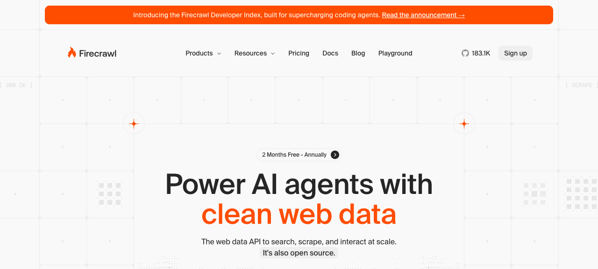

# CrossCheck UI design notes

The workspace design was informed by a browser review of <https://www.firecrawl.dev/> on 2026-09-22. The Firecrawl branding/screenshot endpoint was unavailable because of quota limits, so the reference uses a browser screenshot and computed styles.

## Visual direction

The reference site uses an almost white background, a fine light-gray grid, large black headings, and orange accents and primary buttons. Its measured fonts were Suisse and GeistMono. This project uses system Chinese sans-serif and monospace fonts to avoid remote font dependencies.

The workspace keeps its own CrossCheck identity without Firecrawl trademarks or marketing copy. It adds a light sidebar and compact configuration forms.

## Design tokens

- Accent: `#ff4f00`; hover: `#e54700`; pale orange: `#fff2eb`.
- Body text: `#262626`; secondary text: `#737373`; background: `#fafafa`; panels: `#ffffff`; borders: `#e8e8e8`.
- Spacing: 4, 8, 12, 16, 24, 32, and 48 px. Corner radius: 8–12 px. Shadows are limited to the input panel and overlays.
- Sidebar width: 216 px. Maximum workspace width: 1080 px. On mobile, navigation moves to the top.
- Main heading: 40–48 px; body: 14 px; supporting text: 12 px.

## Components and behavior

The home page uses a centered heading, fine grid, and white input panel. Results use thin-bordered evidence cards. Source configuration uses sectioned panels, explicit labels, keyboard-accessible switches, and a save bar at the bottom.

Configuration status must come from the backend; a saved configuration must not be presented as a successful connection. Success and error messages use `aria-live`. Full API keys are never shown. Every button has a real action.

The interface files are under `static/`: `app.css` defines layout and tokens, while `settings.css` and `settings.js` handle configuration styling and interactions.
